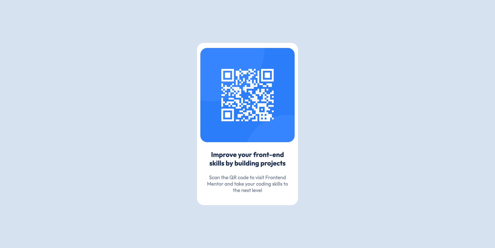

# Frontend Mentor - QR code component solution

This is a solution to the [QR code component challenge on Frontend Mentor](https://www.frontendmentor.io/challenges/qr-code-component-iux_sIO_H). Frontend Mentor challenges help you improve your coding skills by building realistic projects. 

## Table of contents

- [Overview](#overview)
  - [Screenshot](#screenshot)
  - [Links](#links)
- [My process](#my-process)
  - [Built with](#built-with)
  - [What I learned](#what-i-learned)
  - [Code Snippets](#code-snippets)
  - [Continued development](#continued-development)
  - [Useful resources](#useful-resources)
- [Author](#author)

## Overview

### Screenshot



## My process

### Built with

- Semantic HTML5 markup
- CSS custom properties
- Flexbox

### What I learned
I finally learned how to center a div. Well I kind of knew it before, but I can never seem to remember it. But this time I remembered almost all of it. Except setting the height to 100vh so that frustrated me for a bit.

I also learned how to use CSS Custom Properties. It just seemed like the easiest way to deal with the colors when they were in hsl. I also tried writing syntax in a markdown-file. I've never done that before so that was interesting. I was so pretty and structured.

### Code snippets

```css
:root {
    --white: hsl(0, 0%, 100%);
    --lightgray: hsl(212, 45%, 89%);
    --grayblue: hsl(220, 15%, 55%);
    --darkblue: hsl(218, 44%, 22%);
}
```

### Continued development

I need to continue working with and practicing Flexbox. I couldn't quite figure out how to get the padding just right and so that's also something to keep practicing. I also need to learn more about media queries. I decided to just leave it in this project. I need to read up on and practice the mobile first approach.

### Useful resources

- [Markdown Guide](https://www.markdownguide.org/) - This helped me figure out the syntax for a markdown file.
- [CSS Custom Properties](https://developer.mozilla.org/en-US/docs/Web/CSS/Using_CSS_custom_properties) - This iwas great help when it came to creating my CSS Custom Properties.

## Author

- Github - [Linda Jensen](https://github.com/lindajensen)
- Frontend Mentor - [@lindajensen](https://www.frontendmentor.io/profile/lindajensen)
- LinkedIn - [Linda Jensen](www.linkedin.com/in/linda-jensen-swe)